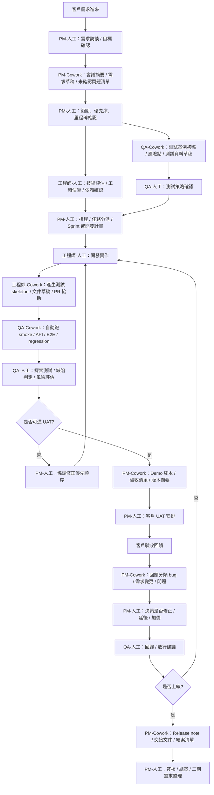
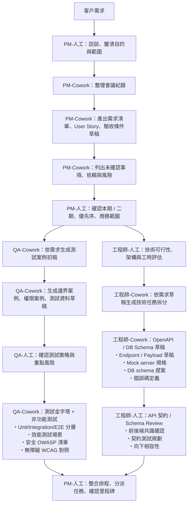
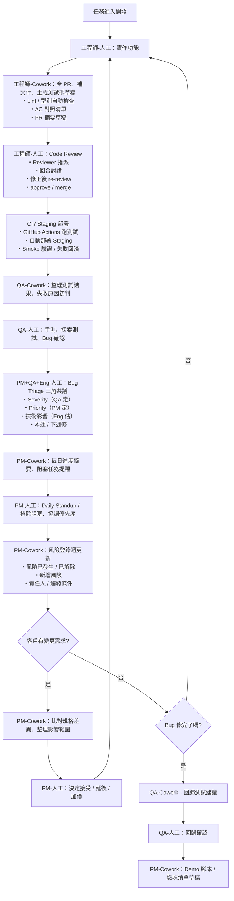
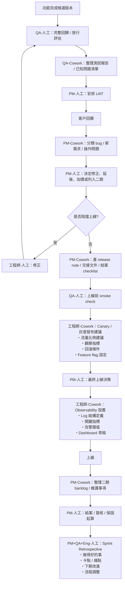

# PM / QA / 工程師與 AI Cowork 接案流程討論紀錄

> 整理日期：2026-05-08  
> 用途：後續企劃、簡報素材、AI cowork 功能規劃、接案流程設計  
> 說明：本檔保留目前對話中可見的完整討論內容、流程圖設計方向、AI cowork 介入點與已產出的圖片素材紀錄。

---

## 0. 本次討論主軸

本次討論圍繞在「軟體接案情境」下，PM、QA、工程師三個角色如何分工，以及 AI cowork 可以如何作為助理輔助團隊加速作業。

核心問題包含：

1. 以工程師角度來看，在進入開發時，PM 與 QA 分別要做什麼？
2. 開發前、開發中、開發後，各角色有哪些工作？
3. 哪些工作適合 AI cowork / Claude Code / 腳本自動化？
4. 哪些工作仍需要人工決策、確認與負責？
5. 如何把這些內容整理成簡報素材與流程圖？
6. 流程圖上每個節點要標示具體產出，例如功能清單、操作流程、商業規則、測試案例等。

---

# 一、第一輪討論：PM、QA、工程師在開發流程中的角色

## 使用者提問

> 1.如果我是一名工程師、同事有PM和QA，以一個工程師的角度想，在進入到開發的時候，PM跟QA分別要做什麼，工作細分要怎麼樣，在開發期間，有什麼工作，在開發尾聲結束這段又有什麼工作  
> 2.延伸下來，這題請跟上一題分開回答，PM和QA 有什麼事是可以給AI做自動化cowork或是claude code寫腳本  
>  
> 如果有更多的情況環境可以跟我說 目前是以軟體接案的情景下做的情況

---

## 回覆重點整理

### 1. 工程師視角下的 PM / QA 核心價值

| 角色 | 工程師最需要他們幫忙解決的事 |
|---|---|
| PM | 幫工程師降低「需求不清楚、客戶一直改、優先順序混亂」的風險 |
| QA | 幫工程師降低「做完才發現不符合需求、回歸壞掉、驗收失敗」的風險 |

一句話總結：

> PM 負責讓工程師知道「要做什麼、為什麼做、做到什麼程度算完成」；QA 負責確認「做出來的東西是否真的符合需求，且沒有破壞既有功能」。

---

## 2. 開發前 / 開發剛開始

這一階段的重點不是馬上寫 code，而是把「模糊需求」整理成「工程師能開工、QA 能測試、客戶能驗收」的規格。

### PM 要做的事

| 工作項目 | 細分內容 | 工程師需要的產出 |
|---|---|---|
| 需求釐清 | 跟客戶確認功能目的、使用者、流程、商業規則 | 需求文件、User Story、流程圖 |
| 範圍定義 | 哪些是本期要做、哪些不做、哪些是加購或二期 | Scope list、Out of scope list |
| 優先順序 | 排出 Must / Should / Could | 開發順序、里程碑 |
| 驗收條件 | 每個功能怎樣才算完成 | Acceptance Criteria |
| 畫面與流程確認 | Wireframe、Mockup、操作流程 | Figma、流程圖、API 流程 |
| 時程規劃 | 切階段、排開發、測試、UAT、上線時間 | 甘特圖、Sprint plan |
| 風險管理 | 第三方 API、客戶資料、權限、付款、法規 | 風險清單、待確認問題 |
| 溝通窗口 | 整理客戶問題，不要讓工程師被客戶直接打斷 | Q&A log、決策紀錄 |

PM 在這階段最重要的不是「排時程」，而是讓需求可以被實作與驗收。

例如不要只寫：

> 會員可以登入。

而是要寫成：

> 使用者可使用 email 與密碼登入；登入成功後導向首頁；登入失敗顯示錯誤訊息；連續錯誤 5 次後鎖定 10 分鐘。

這樣工程師才知道怎麼做，QA 也知道怎麼測。

---

### QA 要做的事

| 工作項目 | 細分內容 | 工程師需要的產出 |
|---|---|---|
| 讀需求 | 看 PM 的規格是否可測 | 可測性問題清單 |
| 找矛盾 | 檢查需求是否互相衝突、流程是否缺漏 | 規格問題回報 |
| 測試計畫 | 決定哪些功能要手測、哪些要自動化 | Test Plan |
| 測試案例 | 根據驗收條件設計測試案例 | Test Cases |
| 測試資料 | 準備一般資料、錯誤資料、邊界資料 | 測試帳號、測試資料表 |
| 測試環境 | 確認 staging / test DB / 測試 API | 測試環境清單 |
| 風險評估 | 找出高風險功能，例如付款、權限、資料刪除 | 高風險測試項目 |

QA 在這階段不能等到工程師做完才進場，因為很多 bug 其實是「需求本身沒講清楚」造成的。

---

## 3. 開發期間

開發期間最怕三件事：

1. PM 一直改需求，但沒有留下紀錄
2. QA 只等最後才測，導致 bug 全部塞在尾聲
3. 工程師做到一半才發現規格有洞

### PM 在開發期間要做的事

| 工作項目 | 細分內容 | 工程師視角的價值 |
|---|---|---|
| 需求答疑 | 工程師遇到不清楚的地方，PM 負責問客戶或做決策 | 避免工程師猜需求 |
| 控制變更 | 客戶臨時新增功能時，判斷是否加價、延後或替換 | 避免 scope creep |
| 更新規格 | 需求有變就更新文件，不只用口頭講 | 避免資訊落差 |
| 追蹤進度 | 看任務是否卡住、是否超時 | 提早暴露風險 |
| 協調依賴 | UI、API、資料庫、第三方服務、客戶資料 | 避免工程師空等 |
| Demo 安排 | 分階段給客戶看，不要最後才驗收 | 降低尾聲大翻車 |
| 優先級調整 | 當時間不夠時，決定哪些先做、哪些延後 | 保護交付核心功能 |

PM 不應該只是問工程師「好了沒」，而是要幫工程師排除「需求、客戶、優先順序、範圍」的障礙。

---

### QA 在開發期間要做的事

| 工作項目 | 細分內容 | 工程師視角的價值 |
|---|---|---|
| 提早測試 | 功能一完成就測，不等全部完成 | bug 越早修越便宜 |
| 建立 bug ticket | 每個 bug 附步驟、環境、截圖、預期/實際結果 | 工程師能快速重現 |
| 回歸測試 | 修 bug 後確認原本功能沒有壞 | 避免修 A 壞 B |
| 探索式測試 | 不只照測試案例，也嘗試異常流程 | 找出規格外問題 |
| API 測試 | 測 API response、錯誤碼、權限 | 後端問題更早發現 |
| UI 測試 | 確認畫面、RWD、按鈕、表單驗證 | 降低客戶驗收問題 |
| 測試案例更新 | 規格改了，測試案例也要同步改 | 避免測舊需求 |

---

## 4. 開發尾聲 / 結案前

這階段不是「工程師寫完 code 就結束」，而是要完成驗收、回歸、上線、交付文件與後續維護界線。

### PM 在開發尾聲要做的事

| 工作項目 | 細分內容 | 產出 |
|---|---|---|
| 驗收範圍確認 | 確認本期交付哪些功能 | Release scope |
| 客戶 UAT 安排 | 請客戶在測試環境驗收 | UAT checklist |
| 驗收問題控管 | 區分 bug、需求變更、新增功能 | Issue classification |
| 上線排程 | 確認上線時間、停機時間、備份策略 | Deployment plan |
| 文件交付 | 操作手冊、帳號資訊、API 文件、維護說明 | Handover docs |
| 結案確認 | 客戶簽核、付款節點、保固期確認 | Sign-off |
| 二期需求整理 | 將本次沒做或新增的需求整理成 backlog | Phase 2 backlog |

PM 在尾聲很重要的一件事是：把 bug 和追加需求分開。

| 類型 | 例子 | 處理方式 |
|---|---|---|
| Bug | 規格寫登入錯誤要提示，但實作沒有提示 | 本期修 |
| 規格遺漏 | 一開始沒提忘記密碼功能 | 看合約，可能加價或排二期 |
| 新需求 | 客戶想加 LINE Login | 新需求估價 |
| 優化 | 按鈕想換顏色、文案想調整 | 視範圍決定 |

---

### QA 在開發尾聲要做的事

| 工作項目 | 細分內容 | 產出 |
|---|---|---|
| 完整回歸測試 | 核心流程全部重測 | Regression report |
| Smoke test | 上線前快速確認主流程可用 | Smoke checklist |
| 驗收測試 | 根據 PM 的驗收條件逐項確認 | UAT support |
| Bug 分級 | Critical / Major / Minor | Bug priority list |
| 修復驗證 | 工程師修完後 retest | Retest result |
| 已知問題整理 | 無法本期修的問題列出 | Known issues |
| 測試結案報告 | 測了哪些、剩哪些、風險是什麼 | Test summary report |

尾聲時 QA 的重點不是「找到越多 bug 越好」，而是幫團隊判斷：

> 這個版本能不能交付？如果不能，是哪些問題阻擋上線？如果可以，有哪些已知風險？

---

## 5. 接案情境下的建議工作流程

```text
需求訪談
  ↓
PM 整理需求 / Wireframe / 驗收條件
  ↓
QA 檢查需求可測性 / 設計測試案例
  ↓
工程師估時 / 拆任務 / 確認技術風險
  ↓
PM 排優先級與時程
  ↓
開發
  ↓
功能完成後交給 QA 測
  ↓
Bug 修復與回歸測試
  ↓
PM 安排客戶 UAT
  ↓
上線前 Smoke Test
  ↓
上線 / 文件交付 / 結案
```

任務狀態可以設計為：

```text
Backlog
→ Ready for Dev
→ In Development
→ Code Review
→ Ready for QA
→ QA Testing
→ Bug Fixing
→ Ready for UAT
→ Client UAT
→ Ready for Release
→ Done
```

---

# 二、AI cowork / Claude Code 可以協助的事項

## PM 可以交給 AI cowork 做的事

| PM 工作 | AI 可以做什麼 | 適合工具 |
|---|---|---|
| 需求整理 | 把客戶訪談逐字稿整理成需求清單 | ChatGPT / Claude |
| User Story | 把功能描述轉成 User Story | AI cowork |
| 驗收條件 | 幫每個需求產生 Acceptance Criteria | AI cowork |
| 任務拆分 | 把大功能拆成前端、後端、DB、QA 任務 | Claude / Claude Code |
| 會議紀錄 | 整理會議摘要、決策、待辦事項 | AI cowork |
| 規格比對 | 比較新版需求和舊版需求差異 | AI cowork |
| Issue 產生 | 從需求文件自動產 GitHub/Jira issue | Claude Code / script |
| Release note | 根據 merged PR 自動產生版本更新說明 | Claude Code |
| 客戶回報整理 | 把客戶訊息分類成 bug / 新需求 / 問題 | AI cowork |
| 風險清單 | 根據需求找出技術風險、第三方依賴 | AI cowork |

---

### PM 自動化腳本例子 1：需求文件轉 GitHub Issues

輸入：

```text
docs/requirements.md
```

輸出：

```text
GitHub Issues:
- [FE] Login page
- [BE] Login API
- [QA] Login test cases
- [DOC] Login user guide
```

Claude Code prompt：

```text
Read docs/requirements.md and create a structured issue list.
For each feature, generate:
1. title
2. user story
3. acceptance criteria
4. frontend tasks
5. backend tasks
6. QA checklist
7. estimated complexity: S/M/L

Output as GitHub issue markdown files under docs/issues/.
Do not modify source code.
```

---

### PM 自動化腳本例子 2：自動產生每日進度報告

```text
今日完成：
- 登入 API
- 註冊頁面 UI
- 密碼驗證規則

進行中：
- 忘記密碼流程
- QA 登入測試

阻塞：
- 客戶尚未提供 SMTP 帳號
```

---

### PM 自動化腳本例子 3：需求變更偵測

```text
requirements_v1.md
requirements_v2.md
```

AI 幫忙輸出：

```text
新增需求：
- 加入 LINE Login
- 後台匯出 CSV

修改需求：
- 密碼長度從 8 碼改成 12 碼

可能影響：
- Login API
- User table
- QA regression test
```

---

## QA 可以交給 AI cowork / Claude Code 做的事

| QA 工作 | AI 可以做什麼 | 適合工具 |
|---|---|---|
| 測試案例產生 | 根據需求自動產 test cases | AI cowork |
| 邊界條件 | 產生錯誤輸入、極端值、空值、權限案例 | AI cowork |
| Bug report 格式化 | 把口語描述整理成標準 bug ticket | AI cowork |
| 測試資料產生 | 產生測試帳號、假資料、CSV | Script / Claude Code |
| API 測試 | 產生 Postman / pytest / curl 測試 | Claude Code |
| E2E 測試 | 產生 Playwright 測試腳本 | Claude Code |
| 回歸測試清單 | 根據本次修改推測要回歸哪些功能 | AI cowork |
| Log 分析 | 分析錯誤 log、console error、API response | AI cowork / script |
| Screenshot 比對 | 自動比對 UI 變化 | Playwright / script |
| 測試報告 | 自動整理 pass/fail、bug 數量、阻塞問題 | AI cowork |

---

### QA 自動化例子 1：需求自動產測試案例

```text
Based on docs/requirements.md, generate QA test cases.

For each feature, include:
1. test case ID
2. scenario
3. precondition
4. test steps
5. expected result
6. priority: Critical / High / Medium / Low
7. type: functional / boundary / permission / regression

Output as docs/test-cases.md.
```

---

### QA 自動化例子 2：Claude Code 產 Playwright E2E 測試

```text
Read the login and registration pages in this codebase.
Generate Playwright E2E tests for:
1. successful login
2. wrong password
3. empty email
4. invalid email format
5. logout flow

Put tests under tests/e2e/auth.spec.ts.
Use stable selectors. If selectors are missing, suggest data-testid changes but do not modify production code yet.
```

---

### QA 自動化例子 3：API 測試自動化

```text
Read the backend routes and generate API tests for user authentication.

Please create tests for:
1. POST /api/login success
2. POST /api/login wrong password
3. POST /api/login missing email
4. POST /api/login invalid payload
5. unauthorized access to protected route

Use pytest or the existing test framework in this repository.
```

---

# 三、第二輪討論：PM / QA 開發前中後的 AI cowork 細節

## 使用者提問

> 部分你舉例的開發前PM能做甚麼事的說法非常好  
> 這部分你能不能把 PM 開發前 開發中 開發後的自動化AI cowork說得仔細點  
> 就是你把cowork真正能做的事跟我說一下 有一些部分我想像不到  
> 除此之外 QA的 開發前 開發中 開發後的也是 QA我覺得我自己更難理解有些部分 可能需要你解釋得比較清楚 白話 詳細點我才OK  
>  
> 再來是 我需要一個大流程圖、開發前流程圖、開發中流程圖、開發後流程圖  
> 流程圖中 都需要PM QA 工程師這三個角色在幹嘛  
> 然後要幫我拆成可以cowork 跟 需要人工 因為我們要的是助理類型 輔助我們加速作業  
> 所以我需要一個很良好的策略 順便說一下 cowork吧 之前我做其他自動化都是排程+程式而已  
> 就例如 我之前做一個直播擷取 每天都會有一場直播 我把那個youtube影片下載後 然後code會切10分鐘好幾個視窗，然後轉成逐字稿最後再用AI的API轉成摘要，這一部分我做得還算滿意，只是這裡面的缺點就是因為多重人生

---

## 1. Automation 與 AI cowork 的差異

你之前做的「下載直播 → 切段 → 轉逐字稿 → AI 摘要」屬於標準的流水線自動化。

它的特色：

- 規則固定
- 輸入輸出明確
- 不太需要判斷商業情境
- 主要是處理資料

常見缺點：

1. 遇到例外就卡住  
   例如影片抓不到、格式變了、逐字稿品質太差。

2. 不會主動追問  
   它不會說：「這段會議紀錄其實需求衝突，你要不要先釐清？」

3. 不知道角色分工  
   它不會分辨：「這件事應該先讓 PM 決策，還是交給 QA 設計測試，還是讓工程師估技術風險？」

4. 沒有人工關卡  
   有些事情產出草稿沒問題，但最後決策一定要人來拍板。

### 定義

#### Automation

- 核心：流程跑完
- 長處：穩定、便宜、快
- 弱點：不會協作、不會判斷脈絡

#### AI cowork

- 核心：AI 當助理，幫角色加速工作
- 長處：會幫你整理、初判、起草、追蹤、提醒、產出模板
- 弱點：不能代替最終決策與責任承擔

一句話：

> Automation 是「機器幫你做事」；Cowork 是「AI 幫你工作，但重要決定還是你來」。

---

## 2. 建議的 3 層策略

### 第 1 層：可全自動

適合排程與腳本：

- 自動抓 issue 狀態
- 自動產每日進度摘要
- 自動把需求文件轉成任務初稿
- 自動跑 API test / E2E test
- 自動產 release note 草稿
- 自動整理 bug 清單

### 第 2 層：AI 起草，人審核

最有價值的 cowork 層：

- 根據會議紀錄整理需求
- 生成 User Story 與驗收條件
- 生成 QA 測試案例
- 分類客戶回報是 bug 還是需求變更
- 根據 PR diff 建議哪些地方要回歸測試
- 整理 UAT 問題與風險

### 第 3 層：必須人工決策

不能交給 AI：

- 是否接受需求變更
- 要不要加價
- 功能優先序
- 是否可上線
- 客戶驗收簽核
- 高風險 bug 是否放行

---

# 四、PM 開發前 / 中 / 後 AI cowork 詳細規劃

## A. PM 在開發前：AI cowork 能幫什麼？

### 1. 會議紀錄整理成「可執行需求」

AI 可以把客戶會議逐字稿整理成：

- 功能清單
- 使用者角色
- 操作流程
- 商業規則
- 未確認事項
- 風險與依賴

白話例子：

客戶說：

> 我們希望會員能登入，之後最好也有 Google 登入，然後主管能看報表，員工不能看全部資料，還有手機上也要能用。

AI 拆成：

- 功能 A：帳密登入
- 功能 B：Google Login
- 功能 C：主管報表
- 權限規則：主管 / 員工
- 非功能需求：RWD
- 待確認：主管報表欄位有哪些？

人工仍需確認：

- AI 有沒有誤解客戶意思
- 哪些是本期做、哪些是二期
- 哪些是客戶隨口提到，不算正式需求

---

### 2. 把需求轉成 User Story / 驗收條件

AI 可以產出：

- User Story
- Acceptance Criteria
- Edge cases
- Definition of Ready 草稿

會員登入例子：

- User Story：身為會員，我想用 email 與密碼登入，方便進入系統。
- Acceptance Criteria：
  1. 可輸入 email/password
  2. 正確登入後跳首頁
  3. 錯誤密碼顯示錯誤訊息
  4. 空欄位要提示
  5. 連錯 5 次鎖定 10 分鐘

---

### 3. 幫 PM 找需求矛盾與缺漏

AI 可以提醒：

- 同一份需求有衝突
- 流程少了一步
- 權限規則不完整
- 客戶說要報表，但沒定義欄位
- 付款流程沒有退款規則
- 有新增功能，但沒描述錯誤處理

例子：

文件寫：

- 員工不可編輯資料
- 員工可修改自己的個人資料

AI 可以提醒：

> 這兩句可能衝突，請確認「不可編輯資料」是否包含個人資料。

---

### 4. 自動拆任務給工程師與 QA

AI 幫忙把需求拆成：

- 前端任務
- 後端任務
- 資料庫任務
- QA 任務
- 文件任務

忘記密碼例子：

- FE：輸入 email 頁面
- BE：發送 reset token API
- BE：重設密碼 API
- DB：reset token 欄位或表
- QA：成功流程 / 過期 token / 重複使用 / 空值 / 錯誤 email

---

### 5. 產生「待客戶確認問題清單」

AI 可列出：

- 報表是否可匯出？
- 主管是否可查看所有部門？
- 忘記密碼連結有效時間多久？
- 會員是否需 Email 驗證？
- 系統是否支援手機瀏覽？

---

### 6. 產生估時前準備包

AI 先幫 PM 準備：

- 功能清單
- 任務拆分草稿
- 依賴項目
- 風險列表
- 開放問題

工程師再確認實際工時與技術可行性。

---

## PM 開發前自動化等級

| 項目 | 建議方式 |
|---|---|
| 會議逐字稿整理 | 幾乎可全自動 |
| User Story 草稿 | AI 起草，人審核 |
| 驗收條件草稿 | AI 起草，人審核 |
| 任務拆分草稿 | AI 起草，工程師確認 |
| 未確認問題清單 | AI 起草，PM 定稿 |
| 範圍決策 | 必須人工 |
| 優先序決策 | 必須人工 |
| 報價 / 加價判定 | 必須人工 |

---

## B. PM 在開發中：AI cowork 能幫什麼？

### 1. 自動做每日進度摘要

資料來源：

- Git commit
- PR 狀態
- Jira / GitHub issue
- QA bug list
- standup notes

產出：

- 今日完成
- 進行中
- 阻塞中
- 需 PM 協助事項

---

### 2. 自動偵測「卡住的任務」

如果一個 task：

- 超過預估工時
- 長時間沒有更新
- 一直在 review
- QA 一直退回

AI 可提醒 PM：

> 這張任務可能卡住，建議確認需求、資源或依賴。

---

### 3. 需求變更比對

AI 比對：

- 變更前規格
- 變更後規格

輸出：

- 新增項
- 刪除項
- 修改項
- 影響模組
- 可能影響 QA 測試範圍
- 建議是否作為 change request

---

### 4. 分類客戶回報：bug、需求變更、操作問題

AI 初步分類：

- Bug
- New Feature
- Enhancement
- User education / how-to
- Need more info

---

### 5. 自動生成 demo 腳本 / 驗收清單

AI 可根據本次完成的功能產出：

- demo 順序
- 要展示的帳號
- 要準備的資料
- demo 話術草稿
- 驗收點 checklist

---

### 6. 自動整理「這版能不能驗收」的狀態

整合：

- 已完成功能
- 未完成功能
- 已知 bug
- 高風險項
- QA 測試結果

輸出：

- 客戶簡報版
- 團隊內部版

---

## PM 開發中自動化等級

| 項目 | 建議方式 |
|---|---|
| 每日進度摘要 | 幾乎可全自動 |
| 阻塞任務提醒 | 幾乎可全自動 |
| 規格差異比對 | AI 起草，人審核 |
| 客戶回報分類 | AI 起草，人判定 |
| Demo 腳本 | AI 起草，PM 修稿 |
| 驗收狀態報告 | AI 起草，PM 定稿 |
| 範圍變更接受與否 | 必須人工 |
| 與客戶談加價 / 延期 | 必須人工 |

---

## C. PM 在開發後：AI cowork 能幫什麼？

### 1. UAT 問題整理與歸類

AI 整理成表格：

- 問題描述
- 所屬模組
- 類型（bug / change request / question）
- 優先級
- 可能負責人
- 是否阻擋上線

---

### 2. Release note / 交付摘要

根據：

- merged PR
- issue closed
- 版本標記
- 本次 scope

產出：

- Release note
- 客戶版更新摘要
- 內部版更新清單

---

### 3. 交接文件草稿

AI 自動整理：

- 功能清單
- 帳號權限說明
- 操作說明
- 已知限制
- 常見問題
- 維護注意事項

---

### 4. 二期需求 Backlog

整理：

- Next phase backlog
- 優先順序草稿
- 需求來源
- 影響對象
- 商業價值摘要

---

### 5. 結案檢核表

AI 可產生：

- 是否完成 UAT
- 是否完成文件交付
- 是否完成上線確認
- 是否完成客戶簽核
- 是否完成保固起算紀錄
- 是否完成待辦轉二期

---

## PM 開發後自動化等級

| 項目 | 建議方式 |
|---|---|
| UAT 問題整理 | AI 起草，人判定 |
| Release note | 幾乎可全自動 |
| 交接文件草稿 | AI 起草，人審核 |
| 二期 backlog | AI 起草，PM 排序 |
| 結案清單 | 幾乎可全自動 |
| 是否放行上線 | 必須人工 |
| 客戶簽核 / 商務確認 | 必須人工 |

---

# 五、QA 開發前 / 中 / 後 AI cowork 詳細規劃

## QA 的白話理解

很多人以為 QA 是「找 bug 的人」，但其實 QA 真正做的是：

1. 把需求翻譯成「怎麼驗證」
2. 提早找出風險
3. 在開發中持續確認品質
4. 在交付前回答：這版能不能上？

QA 不是只在最後按按鈕，而是站在「品質把關者」的位置。

---

## A. QA 在開發前：AI cowork 能做什麼？

### 1. 把需求轉成測試案例初稿

AI 產出：

- 正常流程 test case
- 異常流程 test case
- 邊界值 test case
- 權限 test case
- 驗收對應表

會員登入例子：

- 正確帳密登入
- 錯密碼
- 空 email
- 空密碼
- email 格式錯誤
- 帳號停用
- 連續輸錯鎖定
- 權限不足的使用者登入後看到什麼

---

### 2. 幫 QA 找「沒被寫出來」但應該要測的東西

AI 提醒：

- 權限有沒有分角色？
- 刪除資料有沒有確認？
- 匯出功能有沒有空資料狀況？
- 表單有沒有長度限制？
- 上傳檔案有沒有副檔名限制？
- 錯誤訊息是否清楚？

---

### 3. 自動建立「需求 × 測試」對照表

每個需求對應到：

- 對應 test case
- 對應風險點
- 對應驗收條件

---

### 4. 測試資料設計草稿

AI 可建議：

- 一般測試帳號
- 權限不同帳號
- 極端值資料
- 錯誤格式資料
- CSV / 上傳檔案測試資料

會員系統測試資料例子：

- 一般會員
- 停用會員
- 已驗證會員
- 未驗證會員
- 管理者
- 特殊字元姓名
- 超長 email

---

### 5. 自動產生 API / UI test skeleton

Claude Code 可先生成：

- API test 檔
- Playwright E2E test 檔
- Mock data
- 測試 fixture

---

## QA 開發前自動化等級

| 項目 | 建議方式 |
|---|---|
| 測試案例初稿 | AI 起草，人審核 |
| 邊界測試提醒 | AI 起草，人補充 |
| 需求對照表 | 幾乎可全自動 |
| 測試資料草稿 | AI 起草，人確認 |
| API / E2E skeleton | AI 起草，工程師或 QA 確認 |
| 最終測試策略 | 必須人工 |

---

## B. QA 在開發中：AI cowork 能做什麼？

### 1. 自動產生與維護測試腳本

AI 可以：

- 根據頁面結構生成 Playwright 測試
- 根據 API schema 產生 API test
- 幫你補 assertion
- 幫你補 test data
- 幫你重構重複測試碼

---

### 2. 自動判斷這次 PR 可能要回歸哪些地方

PR diff 範例：

- 修改登入模組 → 回歸登入、登出、忘記密碼、權限驗證
- 修改報表 API → 回歸匯出、篩選、權限
- 修改 user table schema → 回歸會員 CRUD、後台列表

---

### 3. Bug ticket 草稿

AI 整理成：

- 標題
- 環境
- 前置條件
- 重現步驟
- 預期結果
- 實際結果
- 嚴重程度
- 附件說明

工程師最怕 QA 只寫：

> 這裡怪怪的。

AI 可以把 bug 寫成工程師看得懂的格式。

---

### 4. 自動聚合重複 bug / 相似 bug

AI 幫忙判斷：

- 哪些可能是同一個根因
- 哪些只是同類型問題
- 哪些屬於 UI、API、權限、資料一致性

---

### 5. 自動分析測試失敗原因

把以下丟給 AI：

- Playwright log
- error screenshot
- network log
- console log

AI 初判：

- selector 失效
- API 500
- 權限問題
- 資料前置條件不足
- 等待時間問題

---

### 6. 自動跑 smoke / sanity / regression

透過 GitHub Actions：

- PR 建立時跑 smoke test
- nightly 跑 regression
- release 前跑完整流程

---

## QA 開發中自動化等級

| 項目 | 建議方式 |
|---|---|
| 自動化測試腳本初稿 | AI 起草，人修正 |
| Regression 建議 | AI 起草，人確認 |
| Bug ticket 草稿 | AI 起草，人送出 |
| 測試失敗分析 | AI 起草，人判定 |
| Smoke / Regression 執行 | 幾乎可全自動 |
| 最終 bug severity | 必須人工 |
| 放行與否建議 | QA 人工主導 |

---

## C. QA 在開發後：AI cowork 能做什麼？

### 1. UAT 支援：分類客戶問題

AI 把客戶 UAT 回報分類成：

- 真 bug
- 規格如此
- 新需求
- 操作誤解
- 環境問題

---

### 2. 最終回歸報告 / 上線風險摘要

整合：

- 測試覆蓋率
- 測試通過率
- 尚未修復 bug
- 高風險區域
- 阻擋項

輸出：

- PM 可看的版本
- 工程師可看的版本
- 客戶可看的簡版

---

### 3. 已知問題清單

AI 整理：

- 問題描述
- 影響範圍
- workaround
- 預計修復版本

---

### 4. 測試回顧：下一次該補哪些自動化

AI 根據這次 bug 與測試結果，回顧：

- 哪些 bug 本來可以用自動化提早抓到
- 哪些功能每次都容易壞
- 哪些區塊應優先補測試

---

## QA 開發後自動化等級

| 項目 | 建議方式 |
|---|---|
| UAT 問題分類 | AI 起草，人判定 |
| 測試報告 | AI 起草，人審核 |
| 已知問題清單 | AI 起草，人審核 |
| 下次自動化建議 | AI 起草，人採納 |
| 是否允許上線 | 必須人工 |

---

# 六、AI cowork 導入策略

## 原則 1：AI 只做助理，不做最後決策

- PM 的商業判斷不能外包
- QA 的品質放行不能外包
- 工程師的技術責任不能外包

## 原則 2：讓 AI 優先做「草稿、整理、比對、分類」

這是最穩的使用方式。

## 原則 3：高頻、規則清楚的，交給腳本

例如：

- 自動跑測試
- 自動抓 issue 狀態
- 自動彙整 commit
- 自動產 release note 初稿

## 原則 4：高價值但容易耗時的，交給 AI cowork

例如：

- 需求整理
- 測試案例起草
- bug ticket 起草
- 規格差異比對
- UAT 問題分流

## 原則 5：每個流程都要有人工 checkpoint

這樣才是真正好用的 cowork，而不是亂跑的 agent。

---

# 七、流程圖文字版

## 1. 大流程圖



---

## 2. 開發前流程圖



---

## 3. 開發中流程圖



---

## 4. 開發後流程圖



---

# 八、第三輪討論：流程圖節點要加上具體標點

## 使用者提問

> 先不用做任何動作 因為這是需要討論的事  
> 我需要地確實是簡報的素材 你做的流程圖目前做的挺好  
> 我需要你可以在流程圖上面可以做幾個清單標點 寫說這一個節點有什麼具體的事物  
> 例如說 PM的會議紀錄裡面 具體有1.功能清單 2.操作流程 3.商業規則....就至少3個點  
> QA的部分也是意思一樣 圖片可以寬一點沒關係 但我需要你這樣做

---

## 回覆重點

建議流程圖每個節點改成這種格式：

```text
PM-Cowork：會議紀錄整理
・功能清單
・操作流程
・商業規則
・待確認問題
```

格式：

```text
角色 - 類型：工作名稱
・具體產出 1
・具體產出 2
・具體產出 3
```

類型：

```text
PM-人工
PM-Cowork
QA-人工
QA-Cowork
工程師-人工
工程師-Cowork
```

---

## 節點範例

### 原本節點

```text
PM-Cowork：整理會議紀錄
```

### 改成簡報版節點

```text
PM-Cowork：整理會議紀錄
・功能清單
・操作流程
・商業規則
・待確認問題
```

---

### 原本節點

```text
QA-Cowork：生成測試案例初稿
```

### 改成簡報版節點

```text
QA-Cowork：生成測試案例初稿
・正常流程測試
・異常情境測試
・權限測試
・邊界值測試
```

---

### 原本節點

```text
工程師-人工：技術評估
```

### 改成簡報版節點

```text
工程師-人工：技術評估
・可行性確認
・工時估算
・技術風險
・API / DB 影響
```

---

## 流程圖排版建議

因為每個節點會變大，所以不要用太窄的直線流程圖。建議改成寬版橫向流程圖，比較適合 16:9 簡報。

可以用：

```text
開發前
PM 區塊  →  QA 區塊  →  工程師區塊  →  PM 統整
```

或泳道圖：

```text
PM        ：需求整理、範圍確認、時程規劃
QA        ：測試案例、測試資料、風險檢查
工程師    ：技術評估、任務拆分、架構確認
AI Cowork ：摘要、拆分、比對、草稿產生
```

節點文字建議：

```text
標題 1 行
細項 3～4 點
每點 4～8 個字
```

---

## 建議最後做成 4 張圖

| 圖 | 用途 |
|---|---|
| 大流程圖 | 說明整個接案流程與 AI cowork 介入點 |
| 開發前流程圖 | 說明需求、測試規劃、技術評估如何被加速 |
| 開發中流程圖 | 說明進度追蹤、需求變更、測試與 bug 如何處理 |
| 開發後流程圖 | 說明 UAT、release note、結案與二期需求如何整理 |

標記系統：

```text
人工：需要人決策、確認、負責
Cowork：AI 負責整理、起草、比對、提醒
```

---

# 九、第四輪：根據上述方向產生圖片素材

## 使用者提問

> 是的 麻煩這樣動作看看

---

## 已產出的圖片素材

本次已依照「節點標題 + 具體產出清單」的方式，產生以下 4 張簡報用流程圖：

### 1. 大流程圖：接案軟體開發流程與 AI Cowork 介入點

檔案名稱：

```text
software_development_process_with_ai_support.png
```

用途：

- 說明整體開發流程
- 顯示 PM、QA、工程師三角色
- 標示人工與 AI Cowork 的分工
- 每個節點都有 3～4 個具體產出

---

### 2. 開發前流程圖：需求釐清、測試規劃與技術評估

檔案名稱：

```text
pre_development_process_flowchart_overview.png
```

用途：

- 說明開發前 PM 如何釐清需求
- QA 如何起草測試規劃
- 工程師如何做技術評估
- AI cowork 如何協助整理會議紀錄、測試案例、任務拆分

---

### 3. 開發中流程圖：開發執行、測試驗證與進度協調

檔案名稱：

```text
software_development_process_flowchart_infographic.png
```

用途：

- 說明工程師實作
- QA 測試驗證
- PM 進度與風險追蹤
- AI cowork 如何協助 PR 摘要、自動測試整理、需求變更整理

---

### 4. 開發後流程圖：驗收回饋、上線交付與結案整理

檔案名稱：

```text
post_development_workflow_infographic_diagram.png
```

用途：

- 說明 QA 完整回歸與放行評估
- PM 安排 UAT 與整理回饋
- 工程師修正與上線支援
- AI cowork 產出測試報告、Release Note、交接文件與結案摘要

---

# 十、目前形成的簡報素材方向

## 可用簡報架構

### Slide 1：問題背景

標題：

```text
接案流程中的溝通與交付痛點
```

內容可放：

- 需求容易不清楚
- PM、QA、工程師資訊落差
- 開發中變更多
- 尾聲驗收與回歸壓力大
- 很多工作重複且耗時

---

### Slide 2：AI Cowork 定位

標題：

```text
AI Cowork：不是取代人，而是加速整理、起草與比對
```

內容：

| 類型 | 說明 |
|---|---|
| Automation | 固定流程、排程、腳本 |
| AI Cowork | 根據角色需求協助整理、起草、提醒 |
| Human Decision | 商務、品質、上線與責任仍由人決定 |

---

### Slide 3：大流程圖

放入：

```text
software_development_process_with_ai_support.png
```

說明整體流程。

---

### Slide 4：開發前流程

放入：

```text
pre_development_process_flowchart_overview.png
```

重點：

- PM 需求訪談與範圍確認
- PM-Cowork 整理會議紀錄
- QA-Cowork 起草測試規劃
- 工程師評估可行性
- 最終排程仍由 PM 人工確認

---

### Slide 5：開發中流程

放入：

```text
software_development_process_flowchart_infographic.png
```

重點：

- 工程師實作與 PR
- QA 自動測試與手動確認
- PM 追蹤進度與風險
- AI cowork 幫忙整理測試、需求變更與進度摘要

---

### Slide 6：開發後流程

放入：

```text
post_development_workflow_infographic_diagram.png
```

重點：

- QA 完整回歸
- PM 安排 UAT
- AI 整理驗收回饋與 Release 文件
- 工程師修正上線
- PM 最終簽核與結案

---

### Slide 7：系統可先做的功能

標題：

```text
第一階段可落地的 AI Cowork 功能
```

內容：

| 優先順序 | 功能 | 主要使用者 | 價值 |
|---|---|---|---|
| 1 | 會議紀錄 → 需求摘要 | PM | 減少需求整理時間 |
| 2 | 需求 → User Story / 驗收條件 | PM | 讓工程師與 QA 更快對齊 |
| 3 | 需求 → 測試案例初稿 | QA | 減少測試規劃時間 |
| 4 | PR diff → 回歸測試建議 | QA | 降低漏測風險 |
| 5 | UAT 回饋分類 | PM / QA | 區分 bug、新需求、操作問題 |
| 6 | Release Note / 交接文件草稿 | PM | 加速交付與結案 |

---

# 十一、目前可延伸的計畫方向

## 1. 產品定位

```text
一個給接案團隊使用的 AI Cowork 助理系統，協助 PM、QA、工程師在開發前、中、後快速整理需求、規劃測試、追蹤進度、分析變更、整理驗收與交付文件。
```

---

## 2. 目標使用者

- PM
- QA
- 工程師
- 小型接案團隊
- 中型軟體開發團隊
- 維護案團隊

---

## 3. 核心價值

- 減少需求整理時間
- 降低 PM、QA、工程師之間的資訊落差
- 提早發現需求缺漏與測試風險
- 自動產生測試案例與文件草稿
- 支援 UAT、Release、結案整理
- 讓人負責決策，AI 負責加速

---

## 4. MVP 功能建議

### MVP 1：PM 需求整理助理

輸入：

- 會議逐字稿
- 客戶訊息
- 需求文件

輸出：

- 功能清單
- 操作流程
- 商業規則
- 待確認問題
- User Story
- Acceptance Criteria

---

### MVP 2：QA 測試規劃助理

輸入：

- PM 需求文件
- User Story
- Acceptance Criteria

輸出：

- 正常流程測試
- 異常情境測試
- 邊界值測試
- 權限測試
- 測試資料建議
- 需求 × 測試對照表

---

### MVP 3：開發中進度與變更助理

輸入：

- GitHub Issues
- PR
- Commit
- QA bug list
- 客戶變更需求

輸出：

- 每日進度摘要
- 阻塞提醒
- 需求變更差異
- 受影響模組
- 回歸測試建議

---

### MVP 4：開發後交付助理

輸入：

- UAT 回饋
- QA 測試結果
- PR / issue closed list
- Release scope

輸出：

- Bug / 新需求分類
- Release Note
- 操作手冊草稿
- 交接清單
- 結案摘要
- 二期 backlog

---

# 十二、目前最重要的一句策略

> 把固定規則的工作交給腳本，把整理與起草交給 AI cowork，把商務、品質與放行決策留給人。

---

# 十三、後續可繼續規劃的方向

接下來可以從以下方向繼續展開：

1. 把本內容整理成正式簡報大綱
2. 把 4 張流程圖放入簡報並設計旁白
3. 設計 PM cowork 功能規格表
4. 設計 QA cowork 功能規格表
5. 設計系統架構圖
6. 設計 MVP 階段與開發時程
7. 設計資料流：輸入、AI 處理、人工確認、輸出
8. 設計 prompt template 與 workflow
9. 設計 GitHub / Jira / Notion / Slack 串接方式
10. 整理成計畫書或提案書

---

# 附錄 A：圖片素材檔案清單

以下圖片已在本次對話中產生，可作為簡報素材：

```text
/mnt/data/software_development_process_with_ai_support.png
/mnt/data/pre_development_process_flowchart_overview.png
/mnt/data/software_development_process_flowchart_infographic.png
/mnt/data/post_development_workflow_infographic_diagram.png
```

若將本 Markdown 放在同一資料夾中，可使用相對路徑插入圖片：

```markdown


```

---

# 附錄 B：可直接放進簡報的一句話

## AI Cowork 定義

> AI Cowork 不是取代 PM、QA 或工程師，而是協助他們完成整理、起草、比對、提醒與報告產出，讓人把時間留給決策、驗證與溝通。

## PM 角色

> PM 負責讓需求清楚、範圍可控、時程可管理，AI cowork 則協助整理會議紀錄、產生需求草稿、追蹤變更與彙整驗收回饋。

## QA 角色

> QA 負責把需求轉成可驗證的測試方式，AI cowork 則協助產生測試案例、整理測試結果、分析失敗原因與建議回歸範圍。

## 工程師角色

> 工程師負責技術實作與品質落地，AI cowork 則協助產出 PR 摘要、測試草稿、影響分析與文件草稿。

## 人工與 AI 分工

> AI 負責提高效率，人負責做決策與承擔品質。

